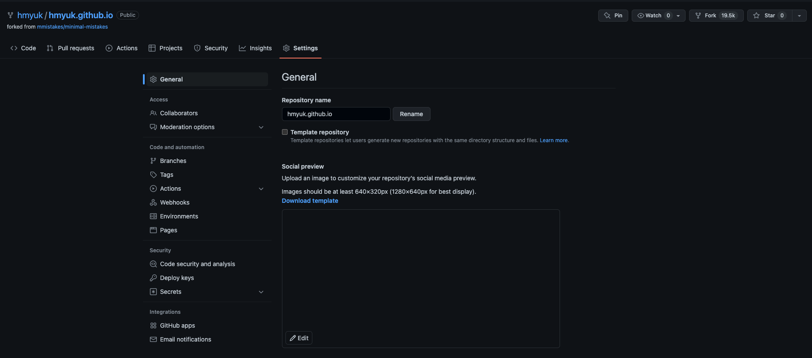

## 순서

>1. 개발에 필요한 개발도구 준비하기
>2. Minimal-mistakes를 내계정 github에 fork 하기
>3. _config.yml 설정 변경하기
>4. 게시글 작성하기
>5. Github Desktop 사용하기
>6. Visual Studio Code 사용하기
>7. Typora를 사용하여 게시글 작성하기
>8. Typroa로 작성한글 서버에 반영하기


## (1). 개발에 필요한 개발도구 준비하기

Github pages로 블로그를 만들기 위해 3가지의 프로그램을 사용하여 블로그를 만들 수 있습니다. 

형상관리에 도움을 주는 github desktop 

문서작성을 쉽게 할 수 있도록 도와주는 Typora 

마지막으로 소스코드 개발 툴인 Visual Studio Code 입니다. 

3가지의 개발 툴을 아래 링크를 통해 다운로드 받아 로컬에 개발환경 세팅을 합니다. 

- Github Desktop  
  : https://desktop.github.com/ 
- Typora  
  : https://typora.io/releases/all 
- Visual studio Code
  : https://code.visualstudio.com/ 

Minimal-mistakes Theme는 여러가지 기능을 제공하여 손쉽게 블로그를 만들 수 있게 도움을 줍니다. 

- Minimal-mistakes  
  : https://mmistakes.github.io/minimal-mistakes/docs/quick-start-guide/ 

Typora로 게시물 작성시 아래의 Markdown 사이트들을 참고하시면 쉽게 게시물을 작성 할 수 있습니다. 

- https://www.markdownguide.org/basic-syntax/
- https://markdown-it.github.io/

-----


## (2). Minimal-mistakes 내계정 Github에 Fork 하기

- minimal-mistakes GitHub 페이지에서 fork 하여 내계정의 repository에 해당 프로젝트를 복사합니다.   
  : https://github.com/mmistakes/minimal-mistakes/fork


- 내 github 계정으로 이동하여 repository-name을 변경 합니다.  
  규칙 : [아이디].github.io  (ex) hmyuk.github.io



## (3). _config.yml 설정 변경하기 

- 나의 git url 주소로 변경 후, 하단의 Commit changes 버튼을 클릭하여 적용한다.

```
url                      : "https://hmyuk.github.io"
```

- 변경 적용후 해당 URL 로 블로그가 접속이 잘 되는지 확인해 봅니다.


## (4). 게시글 작성하기

- Create new File 을 클릭하여 _posts 하위에 포스트 글을 생성합니다.  
  규칙 : _posts/날짜-게시물이름.md    (ex : _posts/2022-06-01-first.md
  아래와 같이 layout , title 등 md 규칙에 맞춰 작성 후 글을 게시 합니다.

```
---
layout: single
title:  "[GitHub Pages로 블로그 만들기] 01. 환경설정"
author_profile: false
---
```


- 사이트에 들어가서 확인하면 작성한 글이 게시 된 것을 확인 할 수 있습니다.

 

## (5). Github Desktop 사용하기

1. Github Desktop을 다운로드 받고 프로그램을 실행하게 되면 로그인 창이 나오게 됩니다.

2. 해당 창에서 본인의 github계정을 입력하시고 로그인을 하게 되면 repository를 clone 받을 수 있게 됩니다.

3. 해당 프로그램을 이용하여 소스를 github 사이트에 upload 할 수 있습니다.


## (6). Visual Studio Code 사용하기

- Visual Studio Code 프로그램을 받고 실행을 하면 아래와같이 화면이 나오는데 Start > Open을 통해 Github DeskTop에서 clone 받아 놓은 프로젝트를 불러옵니다.


- 프로젝트를 불러오면 visual studio code를 통해 편집이 가능한데, md 파일을 제외한 파일들을 해당 프로그램을 통해 편집 하도록 하겠습니다. 
  md 파일을 앞서 말씀드린 Typora 라는 markdown 툴을 이용하는것이 훨씬 편리하기 때문입니다.


## (7). Typora를 사용하여 게시글 작성하기

- Visual Studio Code를 통하여 markdown 형식의 게시글을 작성하려면 어려움이 있습니다.  
  좀 더 편리하게 markdown 문서를 편집하기 위해 Typora를 사용해 보도록 하겠습니다.
- 파일생성은 _posts 하위에 생성을 해주시면 되고, (4)게시글 작성하기의 규칙과 동일하게 작성 해주시면 됩니다.  
  규칙 : _posts/날짜-게시물이름.md
- 파일을 생성하였으면 Typora로 이동하여 open을 통해 해당 게시물을 열고 게시글을 작성해 보도록 하겠습니다.


- 상단에 게시글 layout, title 등을 작성하고 아래는 markdown 형식으로 게시글을 작성해주시면 이미지와 같이 결과를 얻으실 수 있습니다.  
  ex) ## (1).개발에 필요한 개발도구 준비하기 + enter
- 게시글을 변경하신 후 Visual Studio Code로 이동하게 되면 Source Control 영역에 소스 코드가 변경되었음을 나타내는 숫자가 표시되게 됩니다. 


## (8). Typroa로 작성한글 서버에 반영하기

- 작성한 게시글을 반영하는 방법은 2가지가 있습니다.   
  두가지 방법 모두 사용하여 게시글을 서버에 반영해보독 하겠습니다.

8-1.  Github Desktop을 이용하여 서버에 반영하기


- Typora로 게시글을 수정하게 되면, GitHub Desktop의 Changes영역에서 파일이 수정된 것을 확인 할 수 있습니다.
- 하단의 Description영역을 작성하고 Commit to Master 을 누르게 되면 산단에 Fetch origin 의 글자가 Push origin으로 변경되게 됩니다. 해당 텍스트를 클릭하게 되면 서버에 반영되게 됩니다.


8-2. Visual Studio Code로 반영하기


- Typora로 파일을 변경 할 경우, Visual Studio Code에서도 변경 사항을 확인 할 수 있습니다.
- Changes 트리에서 Stage Changes 아이콘 (+)를 클릭한뒤, 상단의(체크 아이콘 V) 를 클릭하면 소스가 커밋되게 됩니다.
- 마지막으로 원격지의 repository에 push하기 위해, 하단의 push 아이콘을 클릭하게 되면 서버에 반영 할 수 있습니다.


