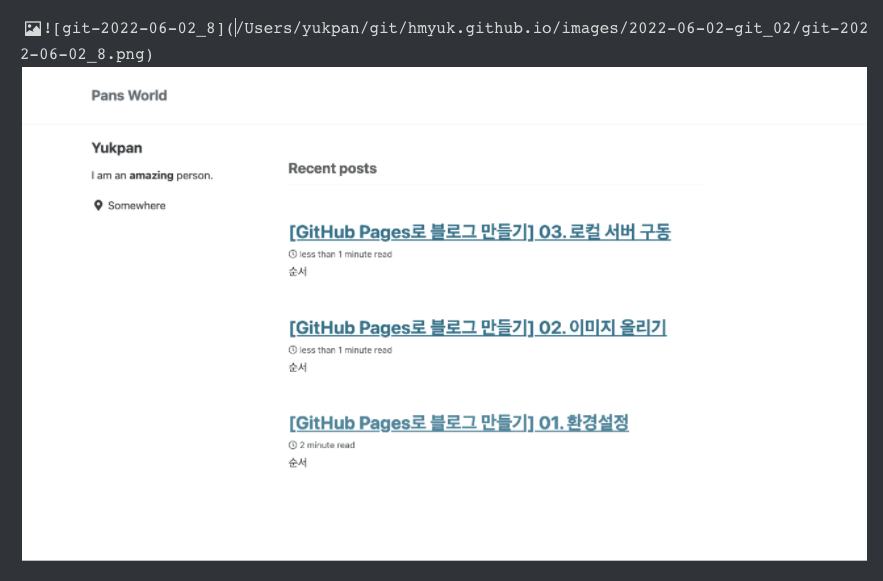

## 순서

>1. 이미지 업로드 
>2. 상대 경로로 Path 변경

## (1). 이미지 업로드

- Typora로 이미지를 업로드 하는것은 매우 간단합니다.   
  게시글에 넣고 싶은 이미지를 Typora 편집기로 드레그를 하여 넣기만 하면 됩니다.

## (2). 상대 경로로 Path 변경

- 파일을 업로드 하면 아래와 같이 /root 부터 Path가 설정이 되어있습니다. 해당 설정을 상대경로로 변경하여 저장하도록 합니다.
- /Users/yukpan/git/hmyuk.github.io/images > ../images

- 해당 이미지가 프로젝트 파일에 잘 생성이 되었는지 확인해 봅니다.

