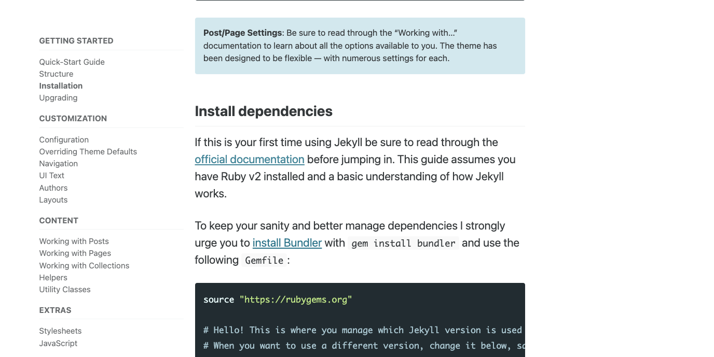
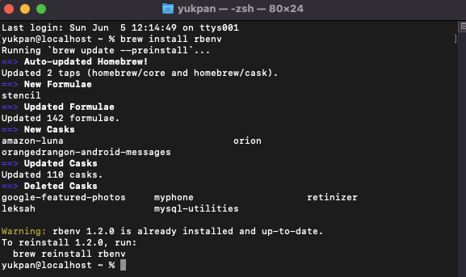
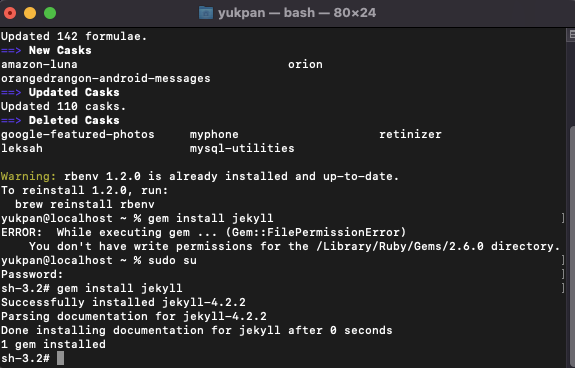
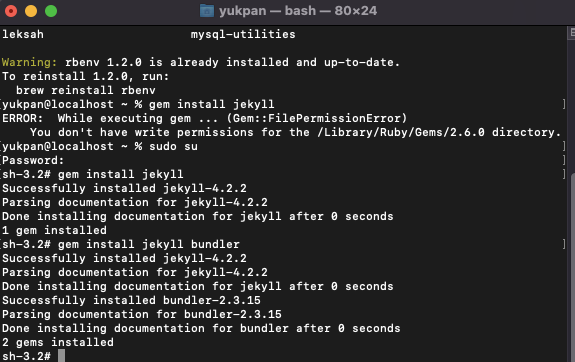
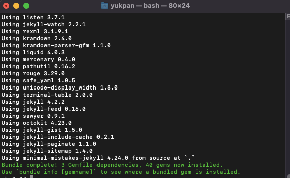
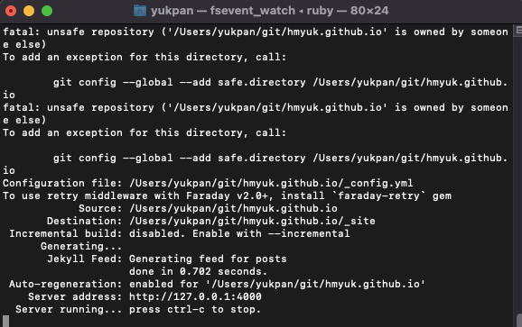
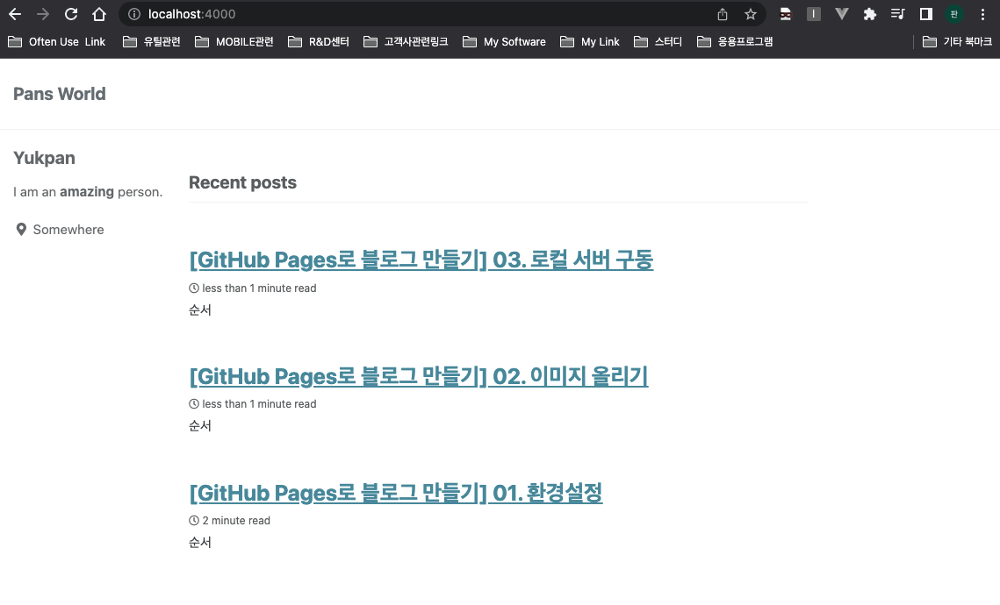

## 순서

>1. Minimal-mistakes 의 Installation 확인하기
>
>2. Ruby 설치하기
>
>3. Jekyll 설치하기
>
>4. bundler 설치하기
>
>5. 프로젝트 폴더에 bundle 설치하기
>
>6. 로컬 서버 구동하기
>


## (1). Minimal-mistakes의 Installation 확인하기

- 해당 사이트로 이동합니다.  
  https://mmistakes.github.io/minimal-mistakes/docs/installation/

- 해당 사이트의 중간 부분에 offical documentation 링크를 눌러 Jekyll 사이트로 이동합니다.




## (2). Ruby 설치하기

- Ruby 공식 사이트로 이동하여 다운로드를 합니다.  
  PC 의 OS에 따라 설치 방법이 약간식 차이가 나니, 설치가 잘 되지 않는 분들은 google에 검색하여 설치 해 보시기 바랍니다.   
  https://www.ruby-lang.org/en/downloads/

- Mac을 기준으로 설치를 진행해 보도록 하겠습니다. (Mac에는 일반적으로 Ruby가 설치 되어있습니다.)

- rbenv를 이용하여 Ruby를 설치합니다.(설치가 되어있을 시 update를 하게 됩니다.). 

``` 
# brew install rbenv
```




## (3). Jekyll 설치하기 

- Gem 명령어를 사용하여 jekyll 을 설치 합니다.  
  gem 명령어는 root 권한으로 이동하여 설치하도록 합니다. (일반 사용자권한으로는 라이브러리 폴더 접근 불가능.)

```
# gem install jekyll
```




## (4). bundler 설치하기

- Bundler 역시 설치 합니다.  

``` 
# gem install jekyll bundler
```




## (5). 프로젝트 폴더에 bundle 설치하기

- 프로젝트 폴더로 이동하여 bundle 을 설치합니다. 

```
# cd /Users/yukpan/git/hmyuk.github.io
# bundle install
```




## (6). 로컬 서버 구동하기

- 다음 명령어 이용하여 로컬 서버를 구동합니다.

```
# bundle exec jekyll serve
```




- 구동이 정상적으로 완료가 되면 아래에 Server address가 나오게 되는데 해당 url로 접근하시면 로컬로 구동된 페이지를 확인 할 수 있습니다.


