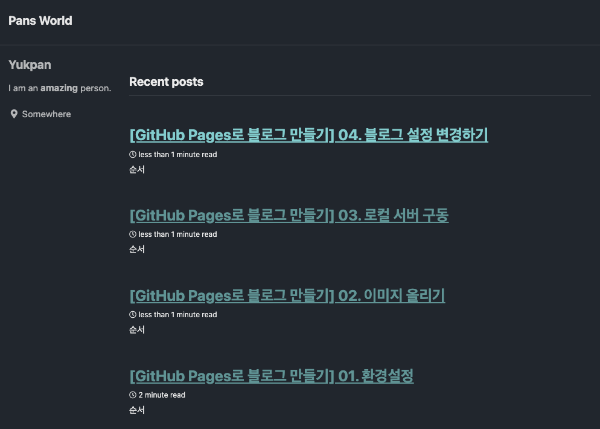
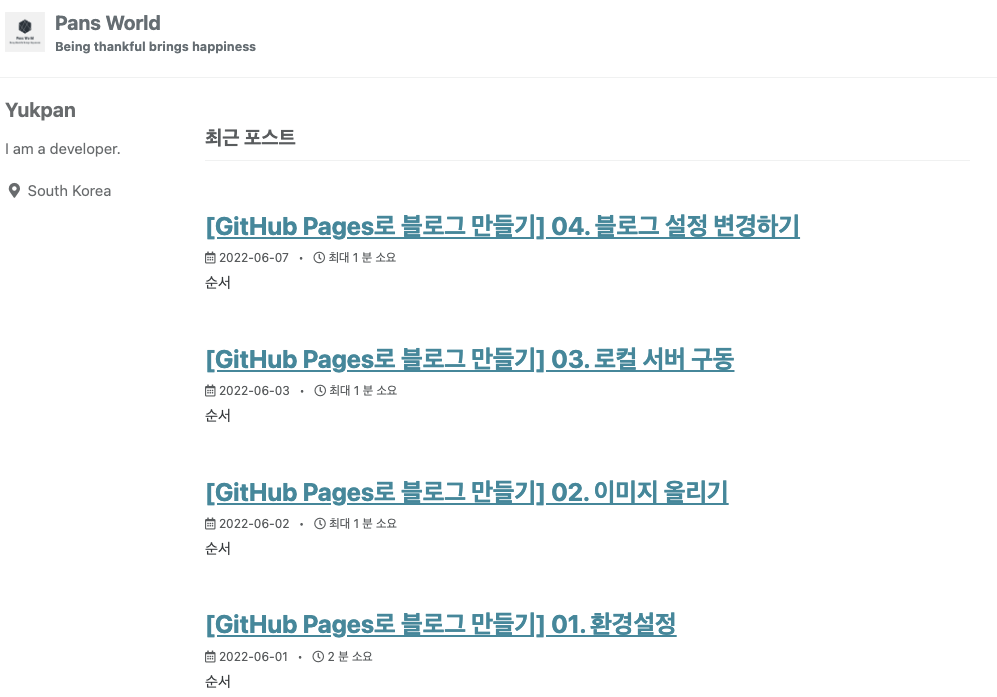
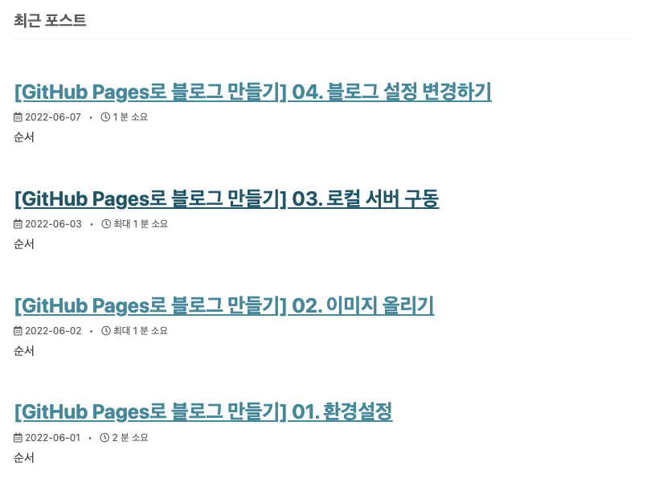

## 순서

>1. Skin 변경하기
>
>2. Locale 변경하기
>
>3. Name , description 변경하기
>
>4. 로고 이미지 등록하기
>
>5. 블로그 날짜 설정하기


## (1). Skin 변경하기

- Visual Studio Code에서 _config.yml 파일을 Open 합니다.
- 해당라인에 skin을 자신이 원하는 skin으로 변경합니다. 
  저는 dark로 변경해 보도록 하겠습니다. (Default -> dark)

```
# theme                  : "minimal-mistakes-jekyll"
# remote_theme           : "mmistakes/minimal-mistakes"
minimal_mistakes_skin    : "dark" # "air", "aqua", "contrast", "dark", "dirt", "neon", "mint", "plum", "sunrise"
```


- yml 파일을 local 서버에 적용할 때는 서버를 재구동 해주어야 수정한 내용이 반영 됩니다.




## (2). locale 변경하기

- _config.yml에 default로 "en-US"이 지정되어 있던 것을 "ko-KR"로 변경해 보도록 하겠습니다.

```
locale                   : "ko-KR"
```


## (3). Name , Description 변경하기

- _config.yml에 name, description을 동일하게 변경해 보도록 하겠습니다.

```
name                     : "Yukpan blog"
description              : "Yukpan의 블로그 입니다."
```


## (4). 로고 이미지 등록하기

- assets 폴더에 이미지를 추가합니다.
- _config.yml 파일에서 logo 를 path에 맞게 변경합니다.

```
logo                     : "/assets/images/logo.png" # path of logo image to display in the masthead, e.g. "/assets/images/88x88.png"
```




## (5). 블로그 날짜 설정하기

- 블로그의 날짜를 설정하기 위해 _config.yml의 설정을 아래와 같이 변경하도록 하겠습니다.  
  show_date: true   
  date_format: "%Y-%m-%d"  

```
# Defaults
defaults:
  # _posts
  - scope:
      path: ""
      type: posts
    values:
      layout: single
      author_profile: true
      read_time: true
      comments: # true
      share: true
      related: true
      show_date: true

date_format: "%Y-%m-%d"
```

- 설정을 변경하면 아래와 같이 블로그 Title 하위에 설정한 포멧대로 날짜가 나오는 것을 확인 할 수 있습니다.



