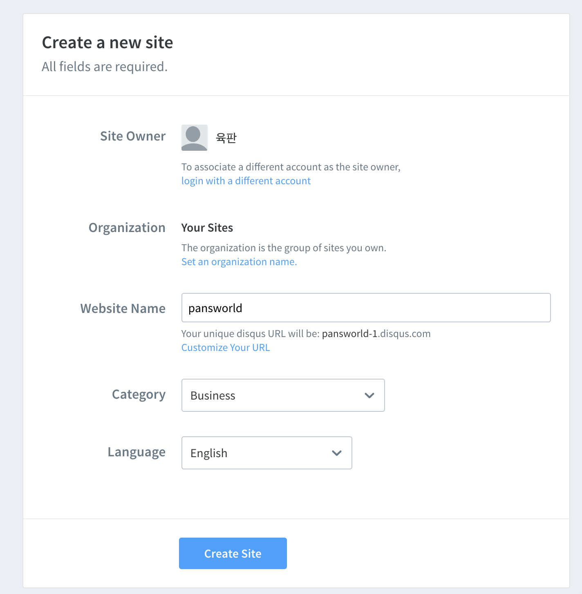

## 순서

>1. 댓글 추가하기
>
>2. 댓글 사이트에 적용하기
>
>3. 구글 애널리틱스 추가하기


## (1). 댓글 추가하기

- 해당 사이트로 이동하여 회원가입을 합니다.
  https://disqus.com/
- 회원가입이 완료 되었으면 로그인한 후 프로필 하단의 Settings을 클릭하여 설정으로 이동합니다.
  

- 우측상단의 톱니모양을 클릭한후, 하단의 Add Disqus To Site 를 클릭합니다.
-  하단에 GET STARTED 버튼을 클릭합니다.
- I want to install Disqus on my site 를 다시 눌러 사이트 설정 화면으로 이동합니다.
- Website Name 등 본인의 사이트에 맞는 설정값을 입력하고 Create Site 버튼을 클릭합니다.
  

- 무료버전을 사용하기 위해 Subscribe Now 버튼을 클릭합니다.
- Select Platform(2)에서 Jekyll 블로그를 선택합니다.
- Install Instructions(2)에서 configure를 선택합니다.
- Configure Disqus(3)에서는 Website URL 에 본인의 블로그 주소를 작성하고 Next버튼을 클릭합니다.
- 마지막으로 Complete setup을 눌러주시면 생성이 완료가 됩니다.


## (2). 댓글 사이트에 적용하기

- Config.yml파일 Defaults에서 설정을 아래와 같이 수정합니다.

```
# Defaults
defaults:
  # _posts
  - scope:
      path: ""
      type: posts
    values:
      layout: single
      author_profile: true
      read_time: true
      comments: true
      share: true
      related: true
      show_date: true
```


- Disqus 설정  
  shortname은 disqus사이트의 admin에서 생성한 website Name을 입력 해 주시면 됩니다.

```
comments:
  provider               : "disqus" 
  disqus:
    shortname            : "pansworld" 
 
```

  

