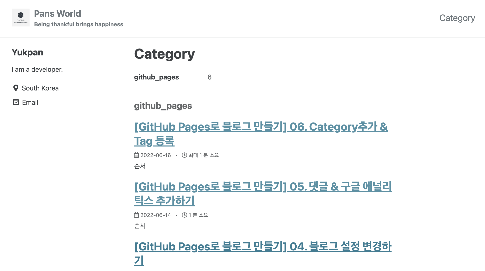
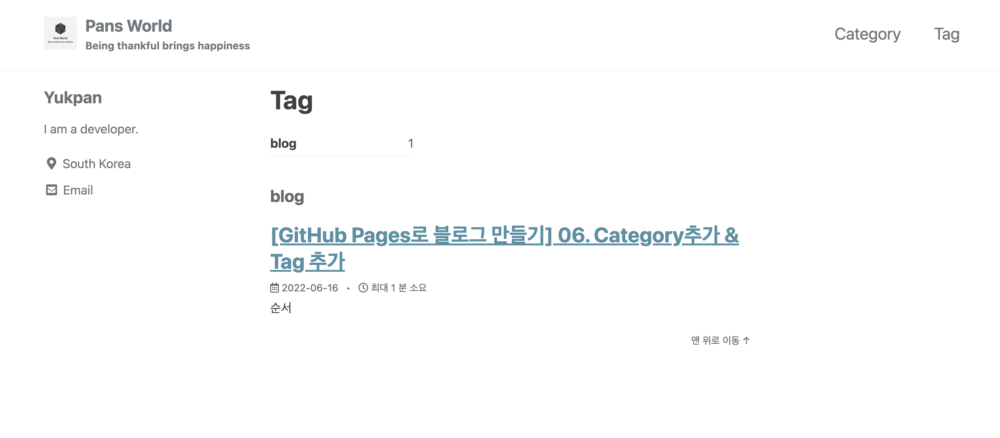

## 순서

>1. Category 추가
>
>2. Tag 추가
>


## (1). Category 추가

- _config.yml 파일을 열어 다음과 같이 수정합니다.	

```
category_archive:
  type: liquid
  path: /categories/
tag_archive:
  type: liquid
  path: /tags/
# https://github.com/jekyll/jekyll-archives
jekyll-archives:
  enabled:
    - categories
    - tags
  layouts:
    category: archive-taxonomy
    tag: archive-taxonomy
  permalinks:
    category: /categories/:name/
    tag: /tags/:name/
```

- _pages 폴더를 만들고 , 파일도 새파일을 클릭하여 아래와 같이 파일을 생성합니다.  
  category-archive.md

```
---
title: "Category"
layout: categories
permalink: /categories/
author_profile: true
sidebar_main: true
---
```

- 게시글 상단 영역에 아래와 같이 설정을 해 줍니다.   
  해당 게시글의 카테고리는 github_pages 입니다.

```
layout: single
title:  "[GitHub Pages로 블로그 만들기] 06. Category추가 & 글 검색"
author_profile: false
categories: github_pages
```

- _config.xml , _pages 폴더의 md 파일 , 게시물 상단의 categories까지 추가하였으면 아래와 같이 상단에 category 가 생성 된 것을 확인 할 수 있습니다.

 


## (2). Tag 추가

- _pages 폴더에 새파일을 클릭하여 아래와 같이 파일을 생성합니다.  
  tag-archive.md

```
---
title: "Tag"
layout: tags
permalink: /tags/
author_profile: true
sidebar_main: true
---

```

- 게시물 상단 영역에 아래와 같이 tag를 넣어주면 category와 동일하게 Tag기능이 활성화 됩니다.

```
---
layout: single
title:  "[GitHub Pages로 블로그 만들기] 06. Category추가 & Tag 추가"
author_profile: false
categories: github_pages
tag : blog
---
```

- 아래와 같이 blog로 Tag를 설정한 게시물만 따로 찾을 수 있습니다.


