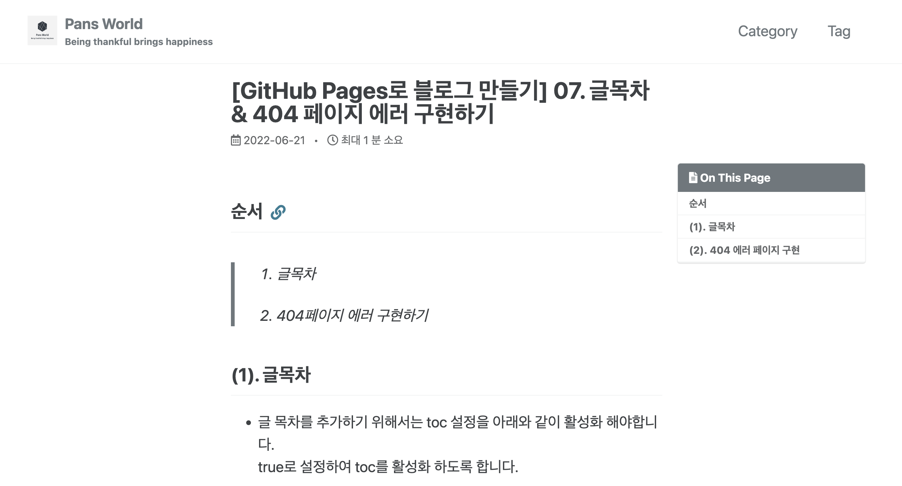
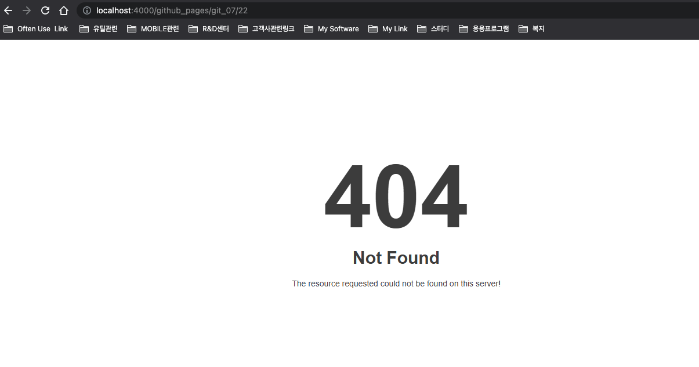

## 순서

>1. 글목차 
>
>2. 404페이지 에러 구현하기 


## (1). 글목차

- 글 목차를 추가하기 위해서는 toc 설정을 아래와 같이 활성화 해야합니다.  
  true로 설정하여 toc를 활성화 하도록 합니다.

```
layout: single
title:  "[GitHub Pages로 블로그 만들기] 07. 글목차 & 404 페이지 에러 구현하기"
author_profile: false
categories: github_pages
toc: true
```


- toc는 heading에 따라 구분되는데 ## , ### 개의 마크다운 문법을 활용해서 구분 하시면 됩니다.  
  ##는 대목차 , ###는 세부목차가 되게 됩니다.   
  #다음에는 띄어쓰기를 해야만 문법으로 인식하니, 이점만 유의해서 사용하시면 손쉽게 목차를 구분 하실수 있습니다.




## (2). 404 에러 페이지 구현 

- _pages 폴더 하위에 404.md 파일을 생성하고 아래와 같이 작성합니다.

```
---
title: "Page Not Found"
excerpt: "Page not found. Your pixels are in another canvas."
sitemap: false
permalink: /404.html
---

Sorry, but the page you were trying to view does not exist.

```

- 해당 예제는 minimal-mistackes의 예제 샘플에서 가져올 수 있습니다.  
  /test/_pages/404.md  
  해당 예제뿐 아니라 다른 예제들도 있으니 활용해 보면 좋을 것 같습니다.

- 하단에 이미지를 넣고 싶으면 아래와 같이 이미지 주소를 가져와 넣어주시면 됩니다.

```
---
title: "Page Not Found"
excerpt: "Page not found. Your pixels are in another canvas."
sitemap: false
permalink: /404.html
---


```




