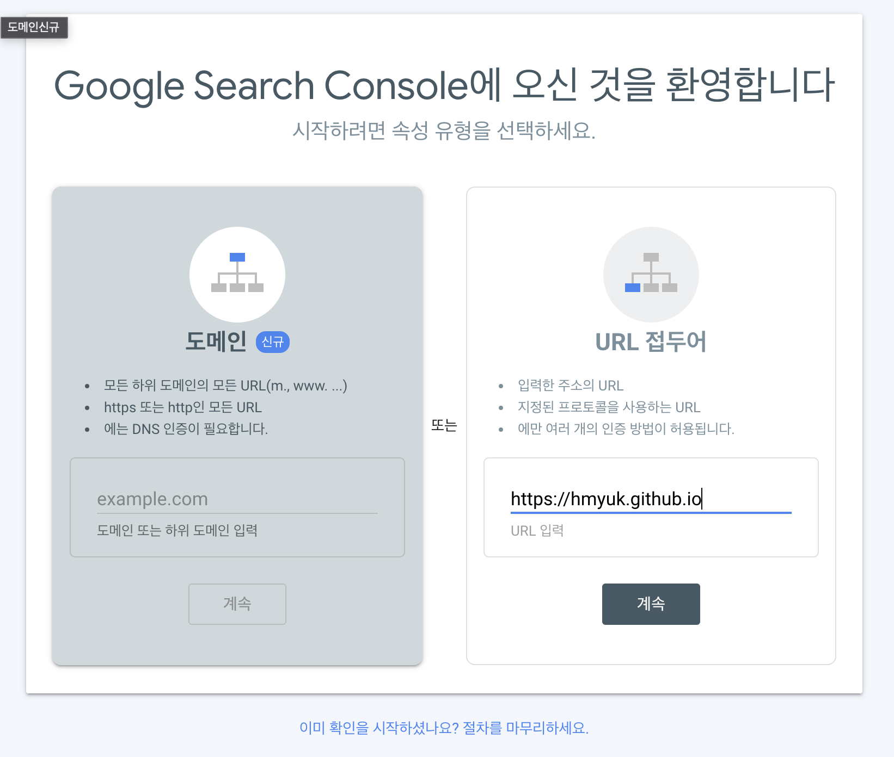
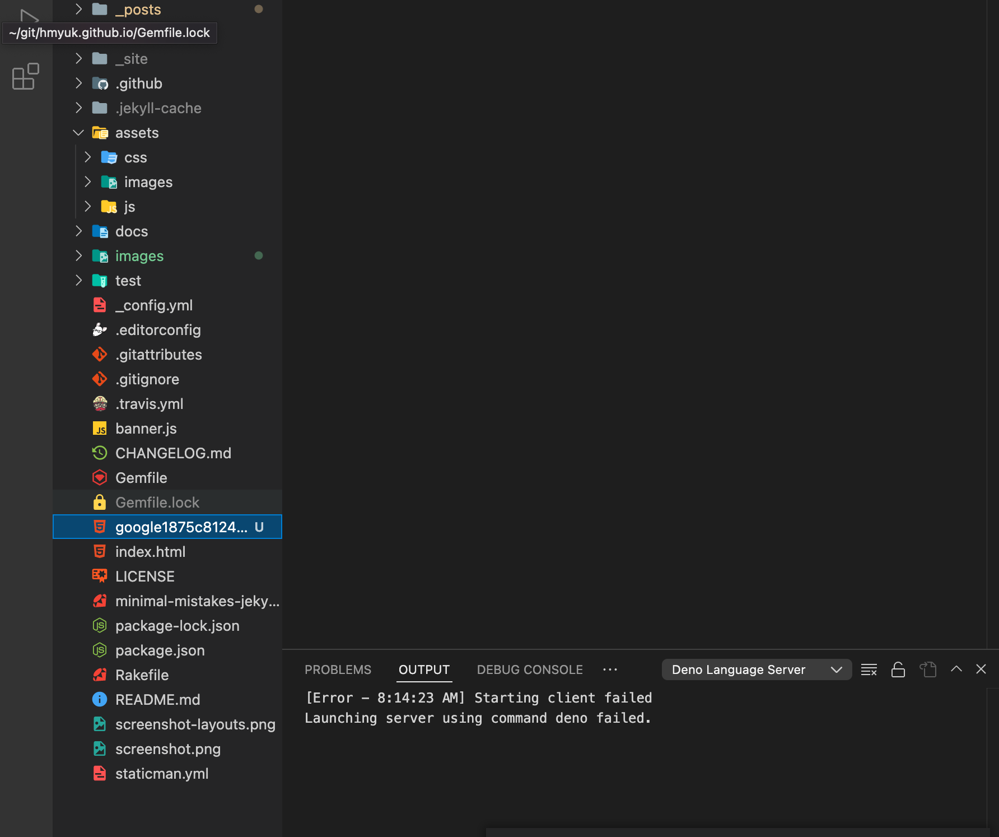

## 순서

>1. 구글 검색 엔진 등록 
>
>2. 404페이지 에러 구현하기 

## (1). 구글 검색 엔진 등록

- 구글 웹마스터 툴즈로 사이트에 먼저 접속합니다.  
  https://search.google.com/search-console/welcome

  

- 계속 버튼을 클릭 하면, 소유권 확인 파일이 나오게 되는 이 파일을 다운로드 한 후 프로젝트에 넣습니다.  
  (아래와 같이 프로젝트의 root에 넣어 주면 됩니다.) 

  